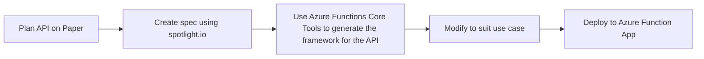

# template_function_app_api
A template for creating an entire REST API deployed in a function app - each request handled by a separate function within the app

# Assumptions
* DB is a MySQL DB
* Function App has an MSI
    * The MSI is in an AD group with access to the MySQL DB
* Models exist, and not just models but two for each: {Thing} and {ThingNew} for the differing requirements of each

# Planned Features

GET and DELETE could be modified to function on any field, not just id.  Would involve something more like `GET <thing>/id=1` instead of `GET <thing>/1`

Then, extend to multi-match `GET <thing>/id=1&attrib=value`

Could also extend to PATCH to do batch updates